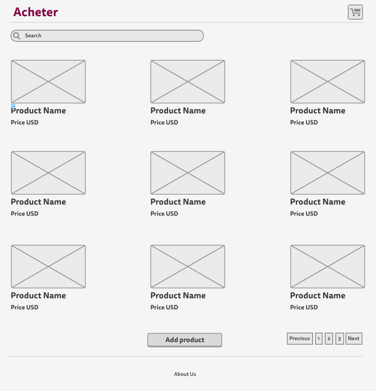
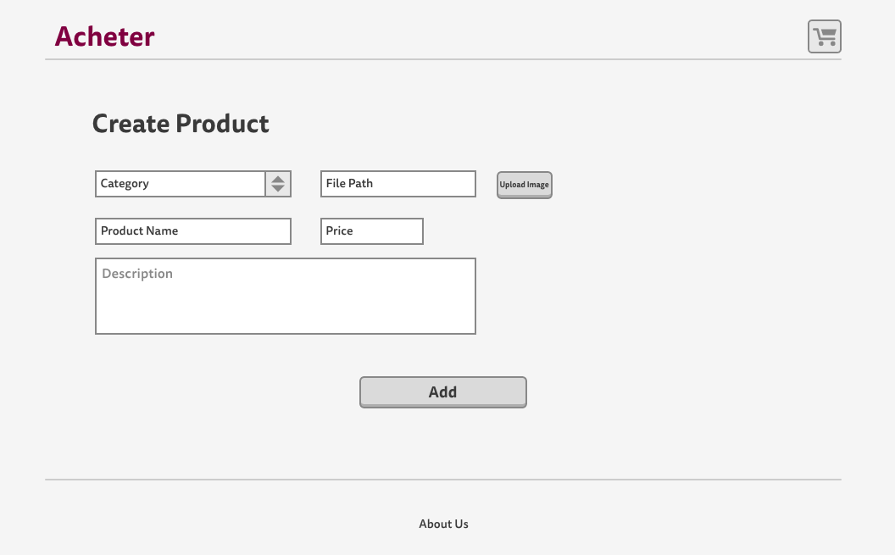
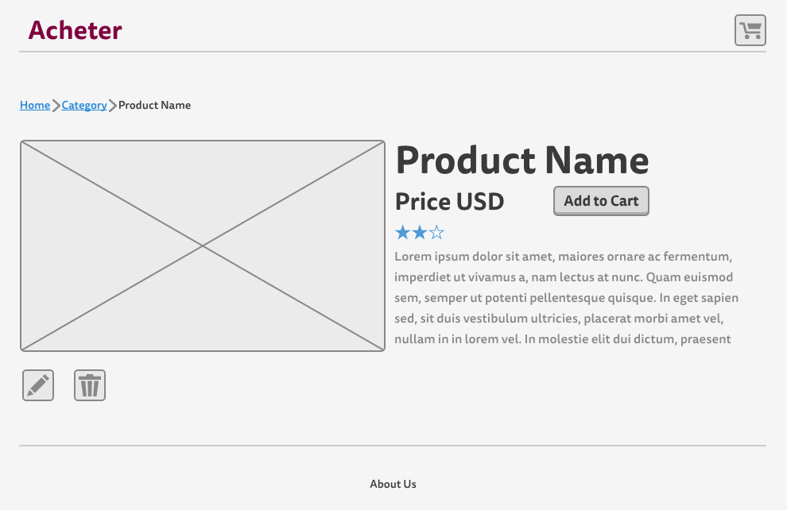
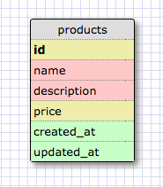

# Acheter

## User Stories

#### MVP
- A user can view all products
- A user can view product details
- A user can add product
- A user can edit a product
- A user can delete a product

###### MVP Mock-ups
-
-
-

#### Stretch 1
- A product has a brand
- A product has a product category
- A product has an image
- A product has reviews
- A user can add a product to a basket
- A user can add a quantity of products to buy

#### Stretch 2
- A product has stock availability
- A product has a delivery time

#### Stretch 3
- A user can checkout products

## Schema screenshot

-

## Installation Notes

Important down the road for listing development dependencies.

## Deployment details and link

- [App Name Link](https:yourthing.herokuapp.com)
